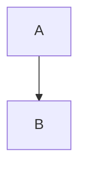

# Nebula Markdown

<div align="center">

**A modern, AI-powered Markdown editor with real-time preview**

[English](README.md) | [中文](README_CN.md)


</div>

## ✨ Features

### Core Editor
- 📝 **Real-time Preview** - Split view with synchronized scrolling
- 🎨 **Dark/Light Theme** - Comfortable editing in any environment
- 💾 **Auto-save** - Changes saved locally, never lose your work
- 📁 **Multi-document** - Manage multiple documents in the sidebar

### Rich Content Support
- 📊 **Mermaid Diagrams** - Flowcharts, sequence diagrams, and more
- 📐 **KaTeX Math** - Beautiful mathematical equations
- 🖼️ **Image Support** - Paste images directly from clipboard
- 📋 **GFM Support** - Tables, task lists, strikethrough, and more

### AI Assistant
- ✨ **Improve Writing** - Enhance clarity, grammar, and flow
- 🔧 **Fix Grammar** - Correct spelling and grammar errors
- 📝 **Tone Adjustment** - Professional or friendly tone
- 📖 **Summarize** - Generate concise summaries
- ✍️ **Continue Writing** - AI continues your text
- 🌐 **Translate** - Translate to/optimize English
- 💬 **Custom Prompt** - Ask AI anything

### Export Options
- 📄 **Markdown (.md)** - Raw markdown with embedded images
- 🌐 **HTML (.html)** - Styled standalone HTML document
- 📑 **Word (.docx)** - Microsoft Word compatible
- 🖨️ **PDF** - Print or download with custom settings

## 🚀 Quick Start

### Prerequisites
- Node.js 18+ 
- pnpm (recommended) or npm

### Installation

```bash
# Clone the repository
git clone https://github.com/yourusername/nebula-markdown.git
cd nebula-markdown

# Install dependencies
pnpm install

# Start development server
pnpm dev
```

The app will be available at `http://localhost:3000`

## ⚙️ Configuration

### AI Features
1. Open **Settings** (gear icon in toolbar)
2. Choose your AI provider:
   - **Gemini**: Get API key from [Google AI Studio](https://aistudio.google.com/apikey)
   - **OpenAI Compatible**: Configure base URL, API key, and model

## 📖 Usage

### Keyboard Shortcuts
| Shortcut | Action |
|----------|--------|
| `Ctrl + B` | Bold |
| `Ctrl + I` | Italic |
| `Ctrl + K` | Insert link |
| `Tab` | Indent |
| `Shift + Tab` | Outdent |

### Markdown Syntax

```markdown
# Heading 1
## Heading 2

**Bold** *Italic* ~~Strikethrough~~

- Bullet list
1. Numbered list
- [x] Task list

> Blockquote

`inline code`

```javascript
// Code block
```

| Table | Header |
|-------|--------|
| Cell  | Cell   |

$E = mc^2$ (inline math)

$$
\int_0^\infty e^{-x^2} dx = \frac{\sqrt{\pi}}{2}
$$ (block math)



<div class="page-break"></div>
```

## 🛠️ Tech Stack

- **React 19** - UI Framework
- **TypeScript** - Type Safety
- **Vite** - Build Tool
- **Tailwind CSS** - Styling
- **react-markdown** - Markdown Rendering
- **KaTeX** - Math Rendering
- **Mermaid** - Diagram Rendering
- **highlight.js** - Code Syntax Highlighting

## 📝 License

MIT License - feel free to use this project for any purpose.

## 🤝 Contributing

Contributions are welcome! Please feel free to submit a Pull Request.

