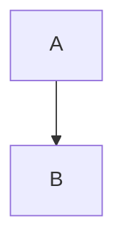

# Nebula Markdown

<div align="center">

**一款现代化的 AI 驱动 Markdown 编辑器，支持实时预览**

[English](README.md) | [中文](README_CN.md)


🌐 **[在线体验](https://qalp4t3y.pinit.eth.limo)** | 📦 **[GitHub](https://github.com/zhajiahe/MDEditor)**

</div>

## ✨ 功能特点

### 核心编辑器
- 📝 **实时预览** - 分屏视图，滚动同步
- 🎨 **明暗主题** - 自由切换，舒适编辑
- 💾 **自动保存** - 本地存储，永不丢失
- 📁 **多文档管理** - 侧边栏管理多个文档

### 富内容支持
- 📊 **Mermaid 图表** - 流程图、时序图等
- 📐 **KaTeX 数学公式** - 优美的数学方程式
- 🖼️ **图片支持** - 直接从剪贴板粘贴图片
- 📋 **GFM 支持** - 表格、任务列表、删除线等

### AI 助手
- ✨ **改进写作** - 提升清晰度、语法和流畅性
- 🔧 **修复语法** - 纠正拼写和语法错误
- 📝 **调整语气** - 专业或友好风格
- 📖 **生成摘要** - 生成简洁的总结
- ✍️ **继续写作** - AI 接续你的文本
- 🌐 **翻译** - 翻译为英文或优化英文
- 💬 **自定义提示** - 向 AI 提问任何问题

### 导出选项
- 📄 **Markdown (.md)** - 原始 Markdown，嵌入图片
- 🌐 **HTML (.html)** - 带样式的独立 HTML 文档
- 📑 **Word (.docx)** - 兼容 Microsoft Word
- 🖨️ **PDF** - 打印或下载，支持自定义设置

## 🚀 快速开始

### 环境要求
- Node.js 18+ 
- pnpm（推荐）或 npm

### 安装步骤

```bash
# 克隆仓库
git clone https://github.com/yourusername/nebula-markdown.git
cd nebula-markdown

# 安装依赖
pnpm install

# 启动开发服务器
pnpm dev
```

应用将在 `http://localhost:3000` 运行

## ⚙️ 配置说明

### AI 功能配置
1. 打开 **设置**（工具栏的齿轮图标）
2. 选择 AI 提供商：
   - **Gemini**: 从 [Google AI Studio](https://aistudio.google.com/apikey) 获取 API Key
   - **OpenAI 兼容**: 配置 Base URL、API Key 和模型名称

## 📖 使用指南

### 快捷键
| 快捷键 | 功能 |
|--------|------|
| `Ctrl + B` | 加粗 |
| `Ctrl + I` | 斜体 |
| `Ctrl + K` | 插入链接 |
| `Tab` | 增加缩进 |
| `Shift + Tab` | 减少缩进 |

### Markdown 语法

```markdown
# 一级标题
## 二级标题

**加粗** *斜体* ~~删除线~~

- 无序列表
1. 有序列表
- [x] 任务列表

> 引用

`行内代码`

```javascript
// 代码块
```

| 表格 | 标题 |
|------|------|
| 单元格 | 单元格 |

$E = mc^2$ (行内公式)

$$
\int_0^\infty e^{-x^2} dx = \frac{\sqrt{\pi}}{2}
$$ (块级公式)



<div class="page-break"></div>
```

## 🛠️ 技术栈

- **React 19** - UI 框架
- **TypeScript** - 类型安全
- **Vite** - 构建工具
- **Tailwind CSS** - 样式框架
- **react-markdown** - Markdown 渲染
- **KaTeX** - 数学公式渲染
- **Mermaid** - 图表渲染
- **highlight.js** - 代码高亮

## 📝 许可证

MIT License - 可自由用于任何目的。

## 🤝 参与贡献

欢迎贡献代码！请随时提交 Pull Request。

